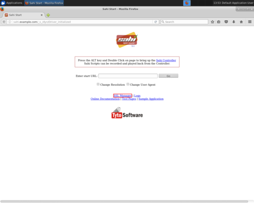
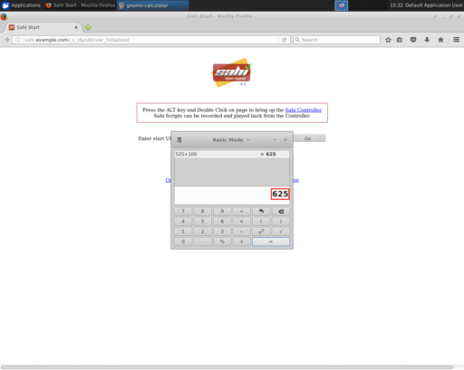
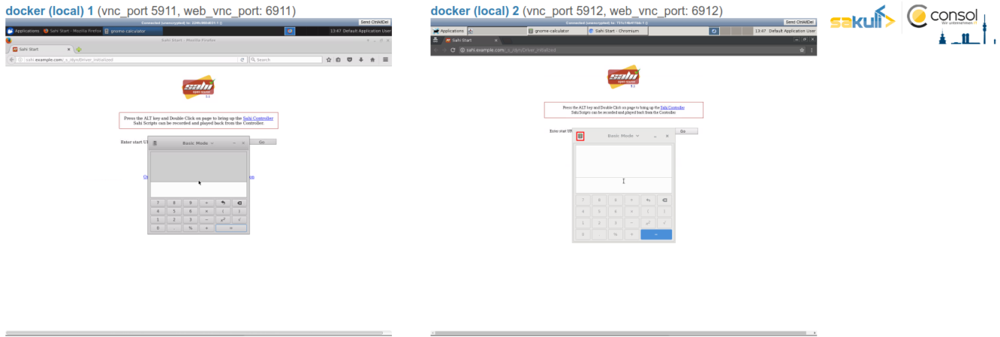

= Sakuli Example: E2E application monitoring in Docker based Xfce UI

== Objectives

* Implement a complete containerized end-to-end monitoring environment
* Testing HTML content
* Testing native UI content
* Setting up a monitoring with:
* Graphs about the performance times
* Alerts on errors with screenshots
* Continuous execution of the test suite in a loop

[[part1]]
== Part 1

NOTE: If you get the exception `java.nio.file.AccessDeniedException: /opt/test/example_xfce/_logs` please ensure that you local files have the correct file permissions. If you not sure you can run `chmod a+rw -R .` or change `user: 1000` to your own user id (execute `id -u`).

=== Testdefinition
First we wan't to create a simple Sakuli test and execute in two different containerized UIs. The test should first validate the starting page of the sahi web testing component. Afterwards it should open the _Gnome Calculator_ and calculate `525 + 100` and validate the Result of `625`. At least the test should open _gedit_ and paste there a message for us that all went fine.

.Web testing component: Sahi starting page

.Native UI component: Calculator + gedit

The implementation of the test case is very simple, you can just mix web and native testing methods. Take a look at the file: link:part_01/example_xfce/case1/sakuli_demo.js[`part_01/example_xfce/case1/sakuli_demo.js`].
[source, js]
----
include::part_01/example_xfce/case1/sakuli_demo.js[]
----

The method `checkCentOS` just makes a small native Linux command to define in witch operating system the test will be executed. If the OS is CentOS Sakuli will the screenshot images from the folder link:part_01/example_xfce/case1/centos[`part_01/example_xfce/case1/centos`] and overwrite the default images defined inlink:part_01/example_xfce/case1[`part_01/example_xfce/case1`].

There are some http://consol.github.io/sakuli/latest/index.html#TestCase.endOfStep[`testCase.endOfStep("<step_name>", <step_waring_time>)`] function calls. There you define that all statements above belong to one teststep. The integer value for `<step_warning_time>` defines what's the maximum time in seconds for executing the above test. If the step breaks the threshold, Sakuli will end in the the state `warning in step`. In [Part 2](#part2), will we se the values represented in a grafana graph.

To define a warning time for the test case, the http://consol.github.io/sakuli/latest/index.html#TestCase[`TestCase`] object have been used:

[source]
----
var testCase = new TestCase(40, 60);
----

The second threshold of `60` seconds, define the critical time. It's also possible define a global waring and critical times for the whole test suite in the file link:part_01/example_xfce/testsuite.properties[`/part_01/example_xfce/testsuite.properties`], if you have more testcases. After all you get this datamodel:

[source]
----
TestSuite: example_xfce, warning time: 50, critical time: 70
|---- TestCase: case1, warning time: 40, critical time: 60
      |---- TestStep: Test Sahi landing page, warning time: 10
      |---- TestStep: Calculation, warning time: 20
      |---- TestStep: Editor, warning time: 20
----

=== Docker Configuration

Now we can configure the runtime environment there we use the Docker image `consol/sakuli-ubuntu-xfce` and for the second environment `consol/sakuli-centos-xfce` container where we mount in our test case definition. To make it easy to start the container, we used https://docs.docker.com/compose/[Docker Compose] to define the setup in the file link:part_01/docker-compose.yml[`part_01/docker-compose.yml`]:

[source, yaml]
----
include::part_01/docker-compose.yml[]
----

NOTE: The user id `user: '1000'` must match to the user id of your linux host system, to be able to write in the mounted volumes. Alternatively you can use the root user `user: '0'`.

To start the both testcases in parallel simply execute:

    $ cd part_01
    $ docker-compose up --force-recreate

During the execution you can open the link:vnc_overview_local.html[VNC Overview Page] to watch the test case execution in live via VNC. The CLI option `--force-recreate` is needed to force Docker Compose to truly start a fresh container instance of the image.

After the execution will find two finished containers:

[source, bash]
----
$ docker-compose ps
               Name                              Command               State    Ports
---------------------------------------------------------------------------------
part01_sakuli_test_centos_chrome_1    /dockerstartup/startup.sh  ...   Exit 0
part01_sakuli_test_ubuntu_firefox_1   /dockerstartup/startup.sh  ...   Exit 0
----

To evaluate if all went fine, just verify the exit code is not `0` or the logs at link:part_01/example_xfce/_logs/_sakuli.log[`part_01/example_xfce/_logs/_sakuli.log`]. Another possibility is to look at the docker logs e.g.

[source, bash]
----
$ docker logs part01_sakuli_test_ubuntu_firefox_1
....
=========== RESULT of SAKULI Testsuite "example_xfce" - OK =================
test suite id: example_xfce
guid: example_xfce__2017_09_29_13_41_20_233
name: example test suite inside of the Xfce desktop for Sakuli
RESULT STATE: OK
result code: 0
db primary key: -1
duration: 29.311 sec.
warning time: 50 sec.
critical time: 70 sec.
start time: 29-09-2017 13:41:20
end time: 29-09-2017 13:41:49
db primary key of job table: -1
browser: Mozilla/5.0 (X11, Linux x86_64, rv:45.0) Gecko/20100101 Firefox/45.0
	======== test case "case1" ended with OK =================
	test case id: case1
	name: case1
	RESULT STATE: OK
	result code: 0
	db primary key: -1
	duration: 17.318 sec.
	warning time: 40 sec.
	critical time: 60 sec.
	start time: 29-09-2017 13:41:27
	end time: 29-09-2017 13:41:45
	start URL: http://sahi.example.com/_s_/dyn/Driver_initialized
	last URL: http://sahi.example.com/_s_/dyn/Driver_initialized
		======== test case step "Test_Sahi_landing_page" ended with OK =================
		name: Test_Sahi_landing_page
		RESULT STATE: OK
		result code: 0
		db primary key: -1
		duration: 1.373 sec.
		warning time: 10 sec.
		start time: 29-09-2017 13:41:27
		end time: 29-09-2017 13:41:29
		======== test case step "Calculation" ended with OK =================
		name: Calculation
		RESULT STATE: OK
		result code: 0
		db primary key: -1
		duration: 13.154 sec.
		warning time: 20 sec.
		start time: 29-09-2017 13:41:29
		end time: 29-09-2017 13:41:42
		======== test case step "Editor" ended with OK =================
		name: Editor
		RESULT STATE: OK
		result code: 0
		db primary key: -1
		duration: 2.729 sec.
		warning time: 20 sec.
		start time: 29-09-2017 13:41:42
		end time: 29-09-2017 13:41:45
===========  SAKULI Testsuite "example_xfce" execution FINISHED - OK ======================

SAKULI_RETURN_VAL: 0
----

[[part2]]
== Part 2

