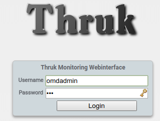
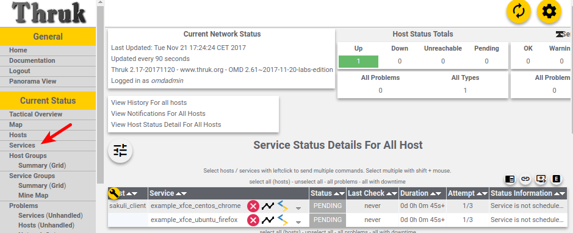
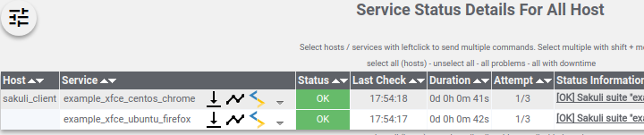
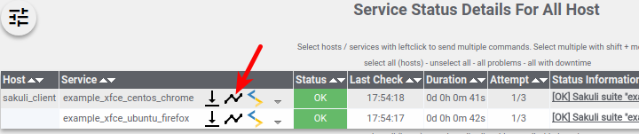
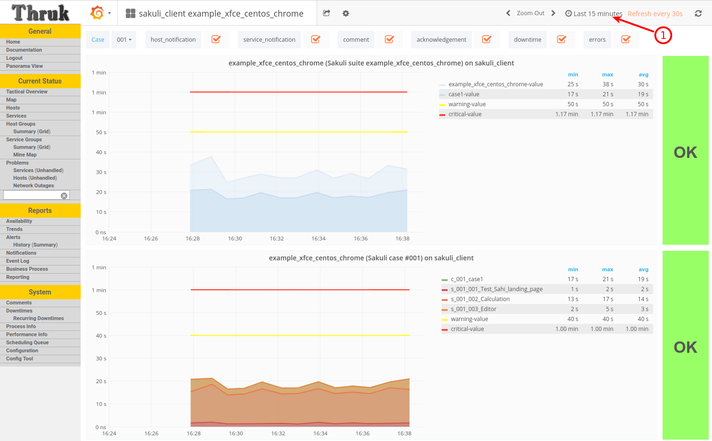
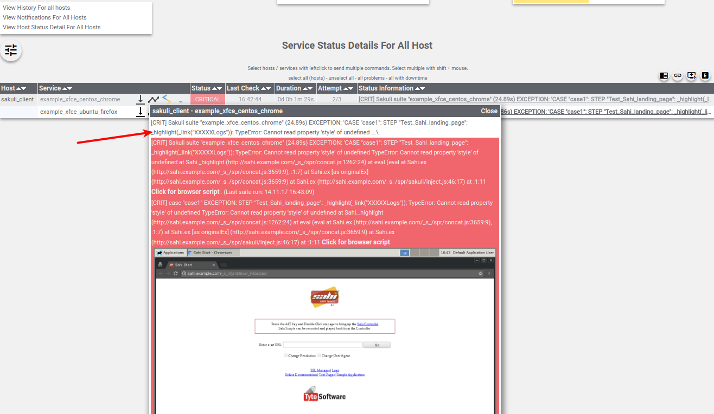
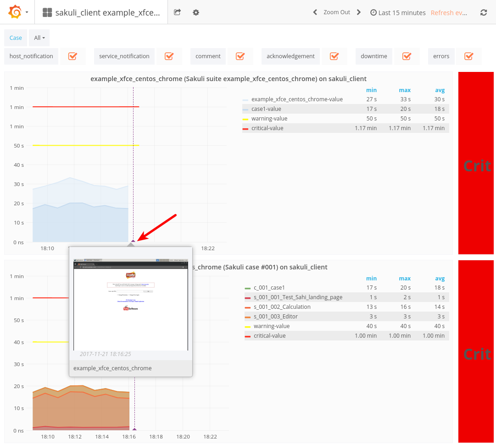

= Sakuli Example: E2E application monitoring in Docker based Xfce UI

== Objectives

* Implement a complete containerized end-to-end monitoring environment
* Testing HTML content
* Testing native UI content
* Setting up a monitoring with:
* Graphs about the performance times
* Alerts on errors with screenshots
* Continuous execution of the test suite in a loop

[[part1]]
== Part 1

NOTE: If you get the exception `java.nio.file.AccessDeniedException: /opt/test/example_xfce/_logs` please ensure that you local files have the correct file permissions. If you not sure you can run `chmod a+rw -R .` or change `user: 1000` to your own user id (execute `id -u`).

=== Testdefinition
First we wan't to create a simple Sakuli test and execute in two different containerized UIs. The test should first validate the starting page of the sahi web testing component. Afterwards it should open the _Gnome Calculator_ and calculate `525 + 100` and validate the Result of `625`. At least the test should open _gedit_ and paste there a message for us that all went fine.

.Web testing component: Sahi starting page
image:.pics/web_content_testing.png[Web testing component: Sahi starting page]

.Native UI component: Calculator + gedit
image:.pics/ui_content_testing.png[Native UI component: Calculator  gedit]

The implementation of the test case is very simple, you can just mix web and native testing methods. Take a look at the file: link:part_01/example_xfce/case1/sakuli_demo.js[`part_01/example_xfce/case1/sakuli_demo.js`].
[source, js]
----
_dynamicInclude($includeFolder);
var testCase = new TestCase(40, 60);
var env = new Environment();
var screen = new Region();
var appCalc = new Application("/usr/bin/gnome-calculator");
var appGedit = new Application("/usr/bin/gedit");

function checkCentOS() {
    var dist = env.runCommand('cat /etc/os-release').getOutput();
    if (dist.match(/NAME=.*CentOS.*/)) {
        Logger.logInfo('Detected distribution: CentOS  >> overwrite some image patterns');
        testCase.addImagePaths("centos");
    }
}

try {
    checkCentOS();
    _highlight(_link(/SSL M.*/));
    _highlight(_link("Logs"));
    _highlight(_link("Online Documentation"));
    _highlight(_link("Test Pages"));
    _highlight(_link("Sample Application"));
    testCase.endOfStep("Test Sahi landing page", 10);
    appCalc.open();

    screen.waitForImage("calculator.png", 5).highlight().mouseMove();

    env.type("525");
    env.sleep(2);
    var calcRegion = appCalc.getRegion();
    calcRegion.find("plus.png").click().type("100");
    calcRegion.find("result.png").click();
    screen.waitForImage("625", 5);
    testCase.endOfStep("Calculation", 20);

    appGedit.open();
    screen.waitForImage("gedit.png", 10);
    env.paste("Initial test passed. Sakuli, Sahi and Sikuli seem to work fine. Exiting...");
    testCase.endOfStep("Editor", 20);

} catch (e) {
    testCase.handleException(e);
} finally {
    // env.sleep(99999999); // usefull to block the execution at the end
    appCalc.close(true); //silent
    appGedit.kill(true);  //silent, without exit prompt
    testCase.saveResult();
}
----

The method `checkCentOS` just makes a small native Linux command to define in witch operating system the test will be executed. If the OS is CentOS Sakuli will the screenshot images from the folder link:part_01/example_xfce/case1/centos[`part_01/example_xfce/case1/centos`] and overwrite the default images defined inlink:part_01/example_xfce/case1[`part_01/example_xfce/case1`].

There are some http://consol.github.io/sakuli/latest/index.html#TestCase.endOfStep[`testCase.endOfStep("<step_name>", <step_waring_time>)`] function calls. There you define that all statements above belong to one teststep. The integer value for `<step_warning_time>` defines what's the maximum time in seconds for executing the above test. If the step breaks the threshold, Sakuli will end in the the state `warning in step`. In <<part2>>, we will see the values represented in a grafana graph.

To define a warning time for the test case, the http://consol.github.io/sakuli/latest/index.html#TestCase[`TestCase`] object have been used:

[source]
----
var testCase = new TestCase(40, 60);
----

The second threshold of `60` seconds, define the critical time. It's also possible define a global waring and critical times for the whole test suite in the file link:part_01/example_xfce/testsuite.properties[`/part_01/example_xfce/testsuite.properties`], if you have more testcases. After all you get this datamodel:

[source]
----
TestSuite: example_xfce, warning time: 50, critical time: 70
|---- TestCase: case1, warning time: 40, critical time: 60
      |---- TestStep: Test Sahi landing page, warning time: 10
      |---- TestStep: Calculation, warning time: 20
      |---- TestStep: Editor, warning time: 20
----

=== Docker Configuration

Now we can configure the runtime environment there we use the Docker image `consol/sakuli-ubuntu-xfce` and for the second environment `consol/sakuli-centos-xfce` container where we mount in our test case definition. To make it easy to start the container, we used https://docs.docker.com/compose/[Docker Compose] to define the setup in the file link:part_01/docker-compose.yml[`part_01/docker-compose.yml`]:

[source, yaml]
----
sakuli_test_ubuntu_firefox:
  image: consol/sakuli-ubuntu-xfce:dev
  volumes:
  - .:/opt/test
  ports:
  - 5911:5901
  - 6911:6901
  user: '1000'
  command: run /opt/test/example_xfce

sakuli_test_centos_chrome:
  image: consol/sakuli-centos-xfce:dev
  volumes:
  - .:/opt/test
  ports:
  - 5912:5901
  - 6912:6901
  user: '1000'
  command: run /opt/test/example_xfce -browser chrome
----

NOTE: The user id `user: '1000'` must match to the user id of your linux host system, to be able to write in the mounted volumes. Alternatively you can use the root user `user: '0'`.

To start the both testcases in parallel simply execute:

    $ cd part_01
    $ docker-compose up --force-recreate

During the execution you can open the link:vnc_overview_local.html[VNC Overview Page] to watch the test case execution in live via VNC. The CLI option `--force-recreate` is needed to force Docker Compose to truly start a fresh container instance of the image.

.link:vnc_overview_local.html[VNC Overview Page]
image:.pics/vnc_overview.png[VNC overview page docker containers]

After the execution will find two finished containers:

[source, bash]
----
$ docker-compose ps
               Name                              Command               State    Ports
---------------------------------------------------------------------------------
part01_sakuli_test_centos_chrome_1    /dockerstartup/startup.sh  ...   Exit 0
part01_sakuli_test_ubuntu_firefox_1   /dockerstartup/startup.sh  ...   Exit 0
----

To evaluate if all went fine, just verify the exit code is not `0` or the logs at link:part_01/example_xfce/_logs/_sakuli.log[`part_01/example_xfce/_logs/_sakuli.log`]. Another possibility is to look at the docker logs e.g.

[source]
----
$ docker logs part01_sakuli_test_ubuntu_firefox_1
....
=========== RESULT of SAKULI Testsuite "example_xfce" - OK =================
test suite id: example_xfce
guid: example_xfce__2017_09_29_13_41_20_233
name: example test suite inside of the Xfce desktop for Sakuli
RESULT STATE: OK
result code: 0
db primary key: -1
duration: 29.311 sec.
warning time: 50 sec.
critical time: 70 sec.
start time: 29-09-2017 13:41:20
end time: 29-09-2017 13:41:49
db primary key of job table: -1
browser: Mozilla/5.0 (X11, Linux x86_64, rv:45.0) Gecko/20100101 Firefox/45.0
	======== test case "case1" ended with OK =================
	test case id: case1
	name: case1
	RESULT STATE: OK
	result code: 0
	db primary key: -1
	duration: 17.318 sec.
	warning time: 40 sec.
	critical time: 60 sec.
	start time: 29-09-2017 13:41:27
	end time: 29-09-2017 13:41:45
	start URL: http://sahi.example.com/_s_/dyn/Driver_initialized
	last URL: http://sahi.example.com/_s_/dyn/Driver_initialized
		======== test case step "Test_Sahi_landing_page" ended with OK =================
		name: Test_Sahi_landing_page
		RESULT STATE: OK
		result code: 0
		db primary key: -1
		duration: 1.373 sec.
		warning time: 10 sec.
		start time: 29-09-2017 13:41:27
		end time: 29-09-2017 13:41:29
		======== test case step "Calculation" ended with OK =================
		name: Calculation
		RESULT STATE: OK
		result code: 0
		db primary key: -1
		duration: 13.154 sec.
		warning time: 20 sec.
		start time: 29-09-2017 13:41:29
		end time: 29-09-2017 13:41:42
		======== test case step "Editor" ended with OK =================
		name: Editor
		RESULT STATE: OK
		result code: 0
		db primary key: -1
		duration: 2.729 sec.
		warning time: 20 sec.
		start time: 29-09-2017 13:41:42
		end time: 29-09-2017 13:41:45
===========  SAKULI Testsuite "example_xfce" execution FINISHED - OK ======================

SAKULI_RETURN_VAL: 0
----

[[part2]]
== Part 2
//TODO TS read for correction

In the second part of the tutorial, we will send the gathered results to a containerized https://labs.consol.de/de/omd/index.html[OMD Labs] monitoring server.

=== Sakuli service config

First we want to create a service configuration for the created sakuli tests. Therefore we created the file link:part_02/omd-nagios/ansible_dropin/xfce_checks/files/sakuli_e2e_monitoring_nagios_objects.cfg[`part_02/omd-nagios/ansible_dropin/xfce_checks/files/sakuli_e2e_monitoring_nagios_objects.cfg`]. For details see http://consol.github.io/sakuli/latest/index.html#omd-gearman[Sakuli Documentation - OMD Gearman Forwarder].

.sakuli_e2e_monitoring_nagios_objects.cfg
[source, cfg]
----
define service {
    name tpl_s_sakuli_xfce_template
    use tpl_s_sakuli_gearman_grafana,tpl_s_sakuli_screenshot_history
    check_command check_dummy!3!'Did not receive any Sakuli result since 15 minutes.'
    freshness_threshold 900
    register 0
    flap_detection_enabled 0
}

define service {
  service_description            example_xfce_ubuntu_firefox
  host_name                      sakuli_client
  use                            tpl_s_sakuli_xfce_template
}

define service {
  service_description            example_xfce_centos_chrome
  host_name                      sakuli_client
  use                            tpl_s_sakuli_xfce_template
}

define host {
  host_name                      sakuli_client
  alias                          Sakuli docker containers
  address                        127.0.0.1
  use                            generic-host
}
----

=== Add service config to OMD

To add the above service configuration to the OMD, we will use the predefined Docker image `consol/omd-labs-centos-sakuli:grafana`, add the sources under `part_02/omd-nagios/ansible_dropin` and call the http://docs.ansible.com/ansible/latest/playbooks.html[Ansible Playbook] link:part_02/omd-nagios/ansible_dropin/xfce_checks[`part_02/omd-nagios/ansible_dropin/xfce_checks/`]. The `main.yml` defines, how Ansible set the timezone, copy the service configuration and configures the http://consol.github.io/sakuli/latest/index.html#_using_aes_encryption_optional[mod-gearman encryption] password:

.link:part_02/omd-nagios/ansible_dropin/xfce_checks/tasks/main.yml[`part_02/omd-nagios/ansible_dropin/xfce_checks/tasks/main.yml`]
[source,yaml]
----
- name: set timezone
  shell: echo 'TZ=Europe/Berlin' >> /opt/omd/sites/demo/etc/environment
- name: Copy Nagios config file
  copy:
    src: sakuli_e2e_monitoring_nagios_objects.cfg
    dest: /opt/omd/sites/demo/etc/nagios/conf.d/
    owner: demo

- name: Copy mod-gearman config file
  copy:
    src: "{{ item }}"
    dest: /opt/omd/sites/demo/etc/mod-gearman/
    owner: demo
  with_fileglob:
    - mod-gearman/*
----

To execute the Ansible playbook at the startup, we mount the folder `ansible_dropin` into to omd container. This is done by the following [Docker Compose] file:

.link:part_02/omd-nagios/docker-compose.yml[`part_02/omd-nagios/docker-compose.yml`]
[source,yaml]
----
omd-nagios:
    container_name: omd-nagios
    image: consol/omd-labs-centos-sakuli:grafana
    ports:
    - 8043:443
    volumes:
    - ./ansible_dropin/:/root/ansible_dropin
----

=== Start OMD

Now all should be configured correctly. So we can start the OMD server, execute

[source, bash]
----
$ docker-compose -f part_02/omd-nagios/docker-compose.yml up

.....
omd-nagios    | PLAY RECAP *********************************************************************
omd-nagios    | localhost                  : ok=4    changed=3    unreachable=0    failed=0
omd-nagios    |
omd-nagios    |
omd-nagios    | omd-labs: Starting site demo...
omd-nagios    | --------------------------------------
omd-nagios    | Preparing tmp directory /omd/sites/demo/tmp...Starting gearmand...OK
omd-nagios    | Starting influxdb....OK
omd-nagios    | Starting Grafana...OK
omd-nagios    | creating datasource nagflux  OK
omd-nagios    | creating datasource _internal  OK
omd-nagios    | creating datasource sakuli  OK
omd-nagios    | Starting gearman_worker...OK
omd-nagios    | Starting nagios...OK
omd-nagios    | Starting dedicated Apache for site demo...OK
omd-nagios    | Starting Nagflux...OK
omd-nagios    | Initializing Crontab...OK
omd-nagios    | OK
omd-nagios    |
omd-nagios    | omd-labs: Starting Apache web server...
omd-nagios    | --------------------------------------
omd-nagios    | AH00558: httpd: Could not reliably determine the server's fully qualified domain name, using 192.168.199.2. Set the 'ServerName' directive globally to suppress this message
----

TIP: To shortcut some sepcial docker-compose commands, we can execute the script link:part_02/omd-nagios/deploy_omd.sh[`part_02/omd-nagios/deploy_omd.sh`] (ensures that containers remove and started fresh)

After the sucessfull startup of the OMD we can now open the OMD Demo page and see two services `example_xfce_centos_chrome` and `example_xfce_centos_chrome`:

1. Open https://localhost:8043/demo
2. Accept the securtiy warning about the seflsigned certificate
3. Login to OMD with user `omdadmin` and password `omd`

4. Click `Services` to get overview page

=== Configure Sakuli tests

After OMD is ready to receive results from Sakuli as passiv check, we need to configure the connection in our Sakuli tests:

1) Add the created OMD network `omd-nagios` as external link to the `docker-compose.yml` of each sakuli test definition, so Sakuli can send data to the OMD server:

.link:part_02/sakuli-tests/docker-compose.yml[`part_02/sakuli-tests/docker-compose.yml`]
[source,yaml]
----
sakuli_test_ubuntu_firefox:
  ...
  external_links:
  - omd-nagios
  command: run /opt/test/example_xfce

sakuli_test_centos_chrome:
  ...
  external_links:
  - omd-nagios
  command: run /opt/test/example_xfce -browser chrome
----

2) Add the following lines to the `sakuli.properties` file. This enables the *gearman forwarder*  and configures the connection to the OMD server:

.link:part_02/sakuli-tests/sakuli.properties[`part_02/sakuli-tests/sakuli.properties`]
[source,properties]
----
# GEARMAN forwarder
sakuli.forwarder.gearman.enabled=true
sakuli.forwarder.gearman.server.host=omd-nagios
sakuli.forwarder.gearman.server.port=4730
sakuli.forwarder.gearman.nagios.hostname=sakuli_client
----

3) Due to the fact, that Sakuli transfer the results encrypted by default, we have also to add the encryption secret to the `sakuli.properties`:

[source,properties]
----
### Gearman encryption
sakuli.forwarder.gearman.encryption=true
sakuli.forwarder.gearman.secret.key=pass4encrypt
----

TIP: For production usage it's also possible to set the environment variable `SAKULI_FORWARDER_GEARMAN_SECRET_KEY`, see http://consol.github.io/sakuli/latest/index.html#property-loading-mechanism[Sakuli - Property loading mechanism].

=== Run the Sakuli tests

Now we can test the setup und run the test like before:

    docker-compose -f part_02/sakuli-tests/docker-compose.yml up

After all went good, the OMD server should now show the services as `OK`:

To get real monitoring runtime data we need to setup a continuous loop which executes the tests all the time and creates some graphs for us. For this execute the helper script link:part_02/sakuli-tests/execute_all_4_monitoring.sh[`execute_all_4_monitoring.sh`]

    part_02/sakuli-tests/execute_all_4_monitoring.sh

NOTE: To stop the loop press `CTRL + C`.

After a few runs we should be able the the some graphs. Therefore click on the *Extra Action* button and a grafana dashboard should appear.

To get better view of the latest results choose `Last 15 minutes` as time interval.

=== Simulate an Error

To get a feeling how Sakuli reacts on errors we will change the testcase definition `sakuli_demo.js` to a not present link validation:

.link:part_02/sakuli-tests/example_xfce/case1/sakuli_demo.js[`part_02/sakuli-tests/example_xfce/case1/sakuli_demo.js`]
[soruce,js]
----
...
try {
    checkCentOS();
    _highlight(_link(/SSL M.*/));
    // remove:  _highlight(_link("Logs"));
    _highlight(_link("XXXX_Logs"));
    _highlight(_link("Online Documentation"));
    _highlight(_link("Test Pages"));
    ...
----

On the next test run in the loop the OMD sever will change the state to `CRITICAL` and shows the error message: `[CRIT] Sakuli suite "example_xfce_centos_chrome" (25.23s) EXCEPTION: 'CASE "case1": STEP "Test_Sahi_landing_page": _highlight(_link("XXXX_Logs")): TypeError:`.

To get a idea about what happens, Sakuli automatically creates an screenshot on every error and append it to the service result:

With the update grafana template it is even possible to see the screenshot directly in the grafana praph, if you hoover over the purple annotation:

== Conclusion

The above tutorial shows how easy it is to setup a fully functional end-to-end monitoring with Sakuli, OMD and Docker. After all is set up, the example test cases can used as template for your own e2e tests and monitoring environment. After the release `1.1.0` it's also possible to run the whole setup in container management software like https://kubernetes.io[Kubernetes] or https://openshift.io/[OpenShift]. To get more information about this or about how to write your own e2e tests take a look to our official http://consol.github.io/sakuli/latest/index.html[Sakuli Documentation].

On questions feel free to contact us through `sakuli@consol.de` or open an issue at Github: https://github.com/ConSol/sakuli-examples/issues/new[github.com/sakuli-examples/issues].

