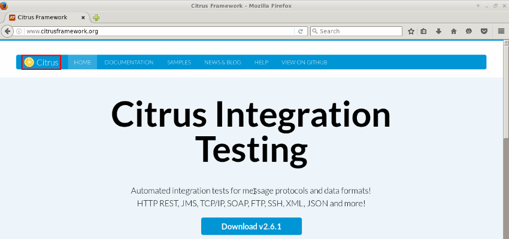
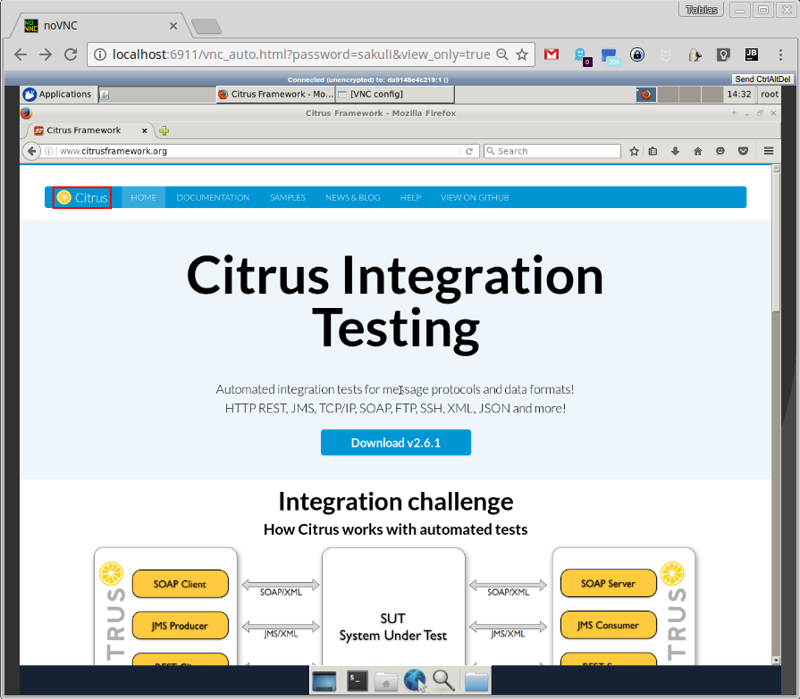

# Example: Containerized Sakuli Tests in Java

This setup shows how easily you can use the [Sakuli Java DSL] to test your application in an end-2-end testing scenario. This is a great starting point to learn how to use [Sakuli] together with [Maven] and [Docker].

## Local test environment (Maven)

    git clone git@github.com:ConSol/sakuli-examples.git [enter]
    cd sakuli-examples/java-example [enter]
    mvn clean test [enter]

After enter `mvn clean test` the maven build will start and execute the `FirstExampleTest` at your local System. The Firefox browser should start up and execute two small tests on the [Citrus Integration Testing] website `http://www.citrusframework.org/`.  If some errors occurs please see [Java DSL - Installation], how to setup your local system.

 

Let's take an look into the Class `FirstExampleTest`. All people that are familiar with TestNG unit testing will notice that a Sakuli Java test is nothing but a normal TestNG unit test. Sakuli just adds the end-to-end testing capabilities. The test class extends the abstract class `AbstractSakuliTest`, what provides convenient access to the [Sakuli Java DSL] API. First we can setup the initializing methods `initTC()` and `getTestCaseInitParameter`:

 ```.java
 public class FirstExampleTest extends AbstractSakuliTest {

     private static final String CITRUS_URL = "http://www.citrusframework.org/";
     private Environment env;
     private Region screen;

     @BeforeClass
     @Override
     public void initTC() throws Exception {
         super.initTC();
         env = new Environment();
         screen = new Region();
         browser.open();
     }

     @Override
     protected TestCaseInitParameter getTestCaseInitParameter() throws Exception {
         return new TestCaseInitParameter("test_citrus");
     }
     //....
 }
 ```
* `browser` field represents the Sahi web browser capabilities. This `browser` object is used in the test to trigger [Sahi] related actions such as opening a website and highlighting links or buttons.
* `env` field represents a controller for the environment during the test execution, where you can get for example the name of your running operating system  `env.getOsIdentifier()`.
* `screen` field represents the whole UI screen as `Region` object, where you can execute a bunch of UI action, see [Sakuli API - Region].

#### HTML Test: `testCitrusHtmlContent`

In the small example below we open the website http://www.citrusframework.org/ and assert the content on that page:

* Heading `Citrus Integration Testing` is visible
* Link starting with `Download v` is working
* Table at the download page contains the link to the version `2.6.1`

```.java
    @Test
    public void testCitrusHtmlContent() throws Exception {
        browser.navigateTo(CITRUS_URL);
        ElementStub heading1 = browser.paragraph("Citrus Integration Testing");
        heading1.highlight();
        assertTrue(heading1.isVisible());

        ElementStub download = browser.link("/Download v.*/");
        download.highlight();
        assertTrue(download.isVisible());
        download.click();

        ElementStub downloadLink = browser.cell("2.6.1");
        downloadLink.highlight();
        assertTrue(downloadLink.isVisible());
    }
```

#### UI Test: `testCitrusPictures`

In this example, we want to check if the UI renders the Citrus page correctly:

* Image pattern `citrus_logo.png`  is rendered correct.
* ConSol logo `consol_logo.png`   is at the bottom of the page loaded.
* The similarity have been reduced to 80% matching `env.setSimilarity(0.8)`, so the different browser rendering won't break the test.

```.java
    @Test
    public void testCitrusPictures() throws Exception {
        browser.navigateTo(CITRUS_URL);
        env.setSimilarity(0.8);
        screen.find("citrus_logo.png").highlight();
        env.type(Key.END);
        screen.find("consol_logo.png").highlight();
    }
```

 For further information about using [Sakuli] and writing real end-2-end tests, take a look at our [Sakuli Documentation]. As next step we want to run the tests in a Docker environment, so that we can include this test easily in our CI builds.  

## Docker environment

    git clone git@github.com:ConSol/sakuli-examples.git [enter]
    cd sakuli-examples/java-example [enter]
    docker-compose up [enter]

Like defined in the `docker-compose.yml`, [Docker Compose] will build a new Docker image of the `docker_image/Dockerfile` and after that, execute the maven build of the `pom.xml`:

```.yml
version: '2'

services:
  sakuli_java_test:
    build: docker_image
    environment:
    - TZ=Europe/Berlin
    volumes:
    - .:/opt/maven/sakuli-java-example
    - data:/root/.m2
    network_mode: "bridge"
    ports:
    - 5911:5901
    - 6911:6901
    command: ["mvn clean test -f /opt/maven/sakuli-java-example/pom.xml"]

volumes:
  data:
    driver: local
```

The Docker image contains a fully defined runtime environment for UI tests with the following components:

* Xserver with window manager
* JDK 8
* Maven
* Some native libraries like OpenCV which are necessary for Sakuli, for more information see [Java DSL - Installation]

After the container is started, you can take a look at into it during the container runtime over the URL [](http://localhost:6911/vnc_auto.html?password=sakuli&view_only=true). The maven build itself will run as described above.



For further information about using [Sakuli] and [Docker], take a look at [Sakuli Docker Containers].

[Sakuli]:https://github.com/ConSol/sakuli
[Maven]:https://maven.apache.org/
[Docker]:https://www.docker.com/
[Docker Compose]:https://docs.docker.com/compose/
[Sahi]:http://sahipro.com/sahi-open-source/
[Sakuli Documentation]:https://github.com/ConSol/sakuli/blob/master/docs/index.md
[Sakuli Java DSL]: https://github.com/ConSol/sakuli/blob/dev/docs/java-dsl.md
[Java DSL - Installation]: https://github.com/ConSol/sakuli/blob/dev/docs/java-dsl.md#installation
[Sakuli API - Region]: https://github.com/ConSol/sakuli/blob/master/docs/sakuli-api.md#Region
[Sakuli Docker Containers]: https://github.com/ConSol/sakuli/blob/master/docs/docker-containers.md
[Citrus Integration Testing]: http://www.citrusframework.org/
