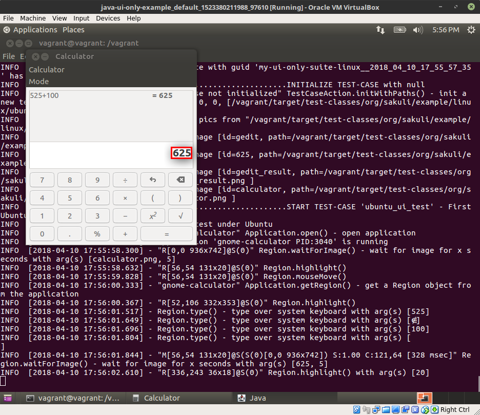

# Sakuli Example: UI only test in Java

In this example you can see, how to right a UI only test with Java and maven. Before execute the tests please check if the following **preconditions** are provided:

* Read the [Concept of Sakuli](http://consol.github.io/sakuli/latest/index.html#concept)
* Ensure that all needed installation packages of your client are installed:
  * [Linux](http://consol.github.io/sakuli/latest/index.html#linux)
  * [Windows](http://consol.github.io/sakuli/latest/index.html#windows)
* Read the introduction of [Maven Execution](http://consol.github.io/sakuli/latest/index.html#maven-execution) type.

After all is done you can execute:

    mvn clean test

By default only the test what fits to your OS will executed, see [`AbstractSakuliUiTest#isTargetEnvironment`](src/test/java/org/sakuli/example/AbstractSakuliUiTest.java)

## Use Vagrant VM

If your local OS won't fit to the defined screenshots under [`src/test/resources/org/sakuli/example`](src/test/resources/org/sakuli/example) you can use for a quick first running test the attached predefined [vagrant](https://www.vagrantup.com) vm defined in the [`Vagrantfile`](Vagrantfile)

### Provision the VM

To get a clear result without unwanted influence of box shadows or some other graphic effects, the [`Vagrantfile`](Vagrantfile) will install the so called [gnome-session-flashback](https://wiki.ubuntuusers.de/GNOME_Flashback/). To ensure that the correct UI session is used, vagrant will shutdown the VM after the installation.

     vagrant up --provision

### Start the test

Start Ubuntu VM and open a terminal:
```
vagrant up --provision
```     

Open the shared project folder and start the tests via maven
```
cd /vagrant
mvn clean test
```

See test case running!


