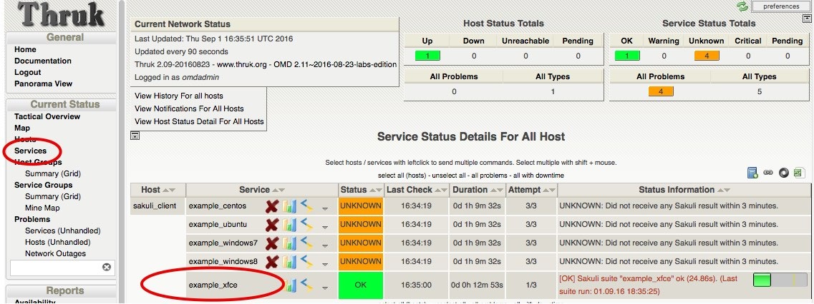
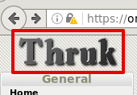

# Tutorial: Sakuli & OMD

This *docker-compose* setup shows how Sakuli and [**OMD labs**](https://labs.consol.de/de/omd/index.html) play well together. You will learn how to bring up the example, explore the code to understand what's happening and learn how to deal with SSL certificates. 

Keep in mind that this is only a demo setup; it is not meant for production use, because 

* this example starts the Sakuli test in "loop" mode. That means that the container lives as long you do not abort the loop execution. Great for testing, but the container will contain more and more cached data; in production each container should live for only one test execution to start each time with a clean, predictable environment. 
* The OMD Labs container is great to build tests and examples like this; the Ansible drop-in mode enables you to quickly deploy changes (and reuse existing Ansible recipes). However, there is no work done (yet) to keep the monitoring data (logs, performance data) persistent. A Docker-based OMD Labs environment would be based on multiple container, volumes and so on. 

Nevertheless it is a great starting point to learn how to use Sakuli together with OMD. Have fun. 


## Quick win: Start the demo environment

    git clone git@github.com:ConSol/sakuli-examples.git [enter]
    cd sakuli-examples/omd-labs-sakuli [enter]
    docker-compose up [enter]
    
Both containers, Sakuli and OMD, should start now:

    ...
    omdlabs    | changed: [localhost] => (item=GEARMAN_NEB on)
    sakulie2e  | INFO  [2016-09-01 17:22:09.000] - sucessfully init sikuli-X screen!
    omdlabs    | changed: [localhost] => (item=MOD_GEARMAN on)
    sakulie2e  | INFO  [2016-09-01 17:22:10.959] - activate the spring context profiles '[GEARMAN]'
    sakulie2e  | INFO  [2016-09-01 17:22:12.206] - read in properties from '/headless/sakuli/sakuli-v1.1.0-SNAPSHOT/config/sakuli-default.properties'
    ...

Nothing exciting so far. Let's connect to both containers to see what's happening.

### Sakuli VNC 

Start a VNC viewer and connect to `localhost:5901` (in case you are running Docker on localhost) or `DOCKERHOST:5901` for a dedicated Docker host/Docker machine. 

On a Mac, you can just open the URL `vnc://localhost:5901` in your browser.

The default password for this VNC session is `sakuli`. 

You should see Sakuli testing the browser, typing a calculation on calc and writing a success message on gedit. After that the test gets shut down and gets started from the beginning. 

### OMD Labs site 

Open the URL `https://localhost:8443/demo` (or `https://DOCKERHOST:8443/demo`) to connect to OMD, where Sakuli sends the test results to. Log in with **omdadmin/omd** and click on "Services" in the left navigation pane. You should see now the service "sakuli_xfce" on host "sakuli_client" with an OK result which gets renewed on every Sakuli run: 



## Explore 

Open `docker-compose.yml` to see how both containers were started: 

### Sakuli startup

```
sakuli:
    container_name: sakulie2e
    image: consol/sakuli-ubuntu-xfce:dev
    volumes:
    - ./sakuli_docker_test:/headless/sakuli_docker_test
    - ./sahi_ff_profile_template:/headless/sakuli/sahi/config/ff_profile_template
    - ./sahi_certs:/headless/sakuli/sahi/userdata/certs
    ports:
    - "5901:5901"
    - "6901:6901"
    command: "run /headless/sakuli_docker_test -loop 1"
    links:
    - omdlabs:omd
```
This block 

* starts a container *sakulie2e*, derived from the image *consol/sakuli-ubuntu-xfce:dev*
* mounts three folders into the container: 
  * `./sakuli_docker_test/` - Sakuli test suite. 
  * `./sahi_ff_profile_template` - Firefox profile template. 
  * `./sahi_certs` - Keystore files (Sahi) for certificates signed by Sahi.
* exposes port 5901/6901 
* creates a link to the container omdlabs (alias: omd)
* runs the "sakuli" starter inside the container with arguments `run /headless/sakuli_docker_test -loop 1`


### OMD startup

```
omdlabs:
    container_name: omdlabs
    image: consol/sakuli-omd-labs-ubuntu
    volumes:
    - ./omd_ansible_dropin_role/:/root/ansible_dropin
    ports:
    - "8443:443"
```

This block

* starts a container *omdlabs*, derived from the image *consol/sakuli-omd-labs-ubuntu*
* mounts one folder into the container: 
  * `./omd_ansible_dropin_role/` - Ansible drop-in role
* exposes port 8443


## Make your own test 

In the following we will create a new Sakuli test which will check the OMD site. This small test should

1. login to OMD
* assert that the check "omd_thruk" exists 
* check that the logo of Thruk is displayed properly

**Steps 1+2** are done with Sahi methods (web-based). For the test creation you do not depend on a docker container; you could also install Sakuli on a desktop system with firefox and record the steps there. The technology is always the same. 

**Step 3** will be done with a Sikuli method, which tries to search a previously recorded screenshot of the logo on the current screen. Sikuli-based actions should always be recorded on the target system.  

### clone the existing test suite

Create a full copy of `sakuli_docker_test`: 
   
    cp -R sakuli_docker_test sakuli_omd 
    
Delete all unneeded items: 

  * `case1/centos/`
  * `case1/*.png`

Edit `sakuli_omd/case1/sakuli_demo.js` and remove everything but this code skeleton: 

    _dynamicInclude($includeFolder);
    var testCase = new TestCase(20, 30);
    var env = new Environment();
    var screen = new Region();

    try {
        // our code
        env.sleep(1000000);
    } catch (e) {
        testCase.handleException(e);
    } finally {
        testCase.saveResult();
    }

(The `sleep` command helps to pause the test at a certain position, examine web content, take screenshots etc. You will use this very often.)


### adapt test properties
Edit `sakuli_omd/testsuite.properties` to change the name of the test. This id will be used as the service name in Nagios: 

    testsuite.id=omd_thruk
    testsuite.name=OMD Test
    
(On the bottom of this file you can find the `sakuli.forwarder.gearman.X` properties which describe the receiving side. This could also be defined on a global basis.)

### adapt docker-compose.yml

Now tell Docker to mount `sakuli_omd` into the container (instead of `sakuli_docker_test`). This is done in `docker-compose.yml`: 
   
    ...
    volumes:
    # - ./sakuli_docker_test:/headless/sakuli_docker_test
    - ./sakuli_omd:/headless/sakuli_docker_test
    - ./sahi_ff_profile_template:/headless/sakuli/sahi/config/ff_profile_template
    - ./sahi_certs:/headless/sakuli/sahi/userdata/certs
    ...

 
### create new Nagios service 
Create the Nagios service object and use the `testsuite.id` as `service_description`: 

    vim omd_ansible_dropin_role/files/sakuli_nagios_objects.cfg
    ...
    define service {
      service_description            omd_thruk
      host_name                      sakuli_client
      use                            tpl_s_sakuli_gearman
    }
 
### Test adaptions
    
Stop and remove all running containers and re-run `docker-compose up`. You should now see a new service "omd_thruk" in OMD. 

Also reconnect to the Sakuli container (VNC). You should see the Sahi default page in Firefox. The test sleeps for 1000000 seconds - enough time to look around. 

Stop both containers again. 

### Save faked certificates 

The web testing component of Sakuli, Sahi, acts as a "man in the middle" (=Proxy) between the web server and the browser. HTTPS web sites are fetched by Sahi using the original server certificate and delivered to the browser with a self-signed certificate from Sahi. Those "fake" certificates are refused by the browser by default and have to be accepted once. 


Start the OMD container: 

    docker-compose up omdlabs [enter]

Then start the Sakuli container with bash and start the Sakuli Dashboard - notice that we have also used the `--link` parameter to be able to talk to OMD from the Sakuli container: 
  
    docker run -it --rm \
      -v $(pwd)/sahi_certs:/headless/sakuli/sahi/userdata/certs \
      -v $(pwd)/sahi_ff_profile_template:/headless/sakuli/sahi/config/ff_profile_template \
      -p 6901:6901 \
      --link omdlabs:omd \
      consol/sakuli-ubuntu-xfce:dev bash [enter]    


As the picturs shows, in the container there are three important folders: 

* `certs`: Keystore files for certificates signed by Sahi.
* `ff_profile_template`: On each container start, Sahi creates a temporarily browser profile based on this folder. 
* `sahi0`: profile dir for Firefox. Files which are not provided by `ff_profile_template` are created by FF on startup.


Start the Sahi dashboard: 

    root@e91f0c7a8935:~# cd /headless/sakuli/sahi/userdata/bin [enter] 
    root@e91f0c7a8935:# ./start_dashboard.sh [enter]

The VNC session will now show the Sahi Dashboard, from where you can start Firefox. On the Sahi start page do the following steps:  

1. click on the link "**SSL Manager**"
- on the warning message "connection is not secure", click on *Advanced* -> *Add Exception...* -> *Confirm*
* The following page "SSL Manager" shows a green mark right of the domain *sahi.example.com* (fake domain), showing that the certificate of Sahi itself is now accepted.
* Now open the URL *http://omd/demo* in a new tab and accept this certificate as well.  
* As soon as you are forwarded to the login page of Thruk, refresh the SSL Manager page and check that the certificate of *omd* is now also accepted.  

Do step 4+5 also for the IP of the OMD host (here https://172.17.0.2) and in general for every other domain you want to test with Sahi. Now shutdown the Sahi dashboard in bash (Ctrl-C). 

Two things happened now: 

* Sahi added a Java Keystore for each accepted certificate domain (e.g. `sahi_example_com`, `omd`) in `~/sakuli/sahi/userdata/certs/`. Because the Sakuli container mounts this directory directly, we have nothing more to do here. 
* The Firefox profile `~/sakuli/sahi/userdata/browser/ff/profiles/sahi0` now contains an updated version of 
  * `cert8.db` - certificate store
  * `key3.db` - key parts of certificates
  * `cert_override.txt` - list of certificate exceptions
  
**Very important now:** Copy the last three files into the template folder for FF profiles (which we have mounted) - only then they get on the host file system: 

    cd ~/sakuli/sahi/userdata/browser/ff/profiles/sahi0 
    cp cert8.db cert_override.txt key3.db ~/sakuli/sahi/config/ff_profile_template/

If you would terminate the Sakuli container and start a new one, you should be able to open the SSL Manager as well as the OMD login page without any certificate hurdles. 

### Record test steps

* The OMD labs container should still be started. 
* In Sakuli, go back to the Sahi start page and click on the **Sahi Controller** Link:
 


* On the controller tab "Record" choose a file name and press "Record". From this point, Sahi will write all steps into the file. 
* Navigate to **https://omd/demo** 
* **Test step 1**: (Login)
  * login with **"omdadmin/omd"** (it might happen that some characters get lost while typing. This is related to the Sahi Javascript in the browser talking to the Rhino Engine of Sahi. This will not happen on playback.)
* **Test step 2**: (Service)
  * click on "**Services**"
  * To check if there is a Nagios service "omd_thruk": 
    * hold down **Ctrl** and move the mouse over the Nagios service "omd_thruk". The Controller will display the Sahi accessor methods to access the element at the current mouse position. 
    * Click on **"Assert"** to auto-generate four different assertion methods. Choose one, delete the other three and click on **"Append to script"**. In this way you can also record actions which are only done by Sahi (e.g. assert that something exists/contains text/... )
    * End the record session by clicking on "**Stop**".
    * Close the Sahi Dashboard in Bash (Ctrl-C) and copy the recorded script into the test folder (which is host-mounted):

```
    root@3fb46e6d9d94:~# cp sakuli/sahi/userdata/scripts/foo.sah sakuli_docker_test/case1/
```

* **Test step 3**: (Thruk logo)
  * take a screenshot of the Thruk logo in the upper left corner. Currently there is no screenshot tool installed in the container; use the one of your host system.  
  * Save the image on the host file system in `./sakuli_omd/case1/thruk_logo.png`



When you are sure that the recorded Sahi script and the screenshot are saved in the host mounted containers, stop both containers again. 

### Write the test

On the host system you can now put all pieces together. 

* Open `sakuli_demo.js` and delete everything in the "try" block
* insert the "navigateTo"-line as shown below
* paste the content of the recorded Sahi script
* write the Sikuli method to search for the Thruk logo

```
    _dynamicInclude($includeFolder);
    var testCase = new TestCase(20, 30);
    var env = new Environment();
    var screen = new Region();

    try {
      _navigateTo("https://omd/demo");
      //Sahi code
      _setValue(_textbox("login"), "omdadmin");
      _setValue(_password("password"), "omd");
      _click(_submit("Login"));
      _click(_link("Services"));
      _click(_link("omd_thruk"));
      _assert(_isVisible(_link("omd_thruk")));
      // Sikuli method
      screen.waitForImage("thruk_logo",10).highlight();
    } catch (e) {
        testCase.handleException(e);
    } finally {
        testCase.saveResult();
    }
```

